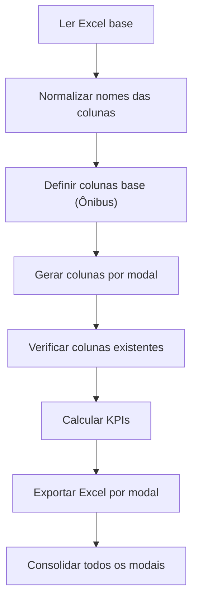

# Explicação do Script: Cálculo de KPIs de Custos e Receitas por Modal

Este script em **Python** processa uma base de dados do **PEMOB Municipal 2024**, gerando **indicadores (KPIs)** financeiros e operacionais por **modal de transporte** (Ônibus, Trem, Metrô, VLT, etc.).
O resultado são arquivos Excel com os **KPIs calculados por modal**, além de um arquivo consolidado com todos os resultados.

---

## 1. Leitura do arquivo base

```python
arquivo = r"..\..\..\data\raw\pemob_municipal_2024.xlsx"
df = pd.read_excel(arquivo, sheet_name="pemob24")
```

* Lê o arquivo Excel com os dados brutos (`pemob_municipal_2024.xlsx`), especificamente a planilha `pemob24`.
* Cria um **DataFrame `df`** com todas as informações.

### Limpeza dos nomes das colunas

```python
df.columns = df.columns.str.strip()
df.columns = df.columns.str.replace('\n', ' ', regex=True)
df.columns = df.columns.str.replace('\xa0', ' ', regex=True)
df.columns = df.columns.str.lower()
```

* Remove espaços, quebras de linha e caracteres não imprimíveis (`\xa0`).
* Converte todos os nomes das colunas para **letras minúsculas** para padronizar.

---

## 2. Identificação das colunas básicas

```python
col_identificacao = ["código", "uf", "município"]
col_identificacao = [c for c in col_identificacao if c in df.columns]
```

* Define quais colunas identificam cada município (`código`, `uf`, `município`).
* Mantém apenas as que realmente existem no arquivo.

Essas colunas serão incluídas em todos os arquivos de saída para identificar o município correspondente a cada linha dos resultados.

---

## 3. Definição dos modais

```python
mapa_modais = {
    "bicicletas compartilhadas": "Bicicletas compartilhadas",
    "metrô": "Metrô",
    "nenhum": "Nenhum",
    "ônibus": "Ônibus",
    "táxi": "Táxi",
    "trem": "Trem",
    "vlt": "VLT",
    "vans/microônibus": "Vans/Microônibus"
}
```

* Cria um **dicionário de modais** para iterar e gerar KPIs específicos para cada tipo de transporte.
* O nome em minúsculas é usado para substituição nos textos das colunas, e o nome capitalizado é usado para exibição.

---

## 4. Definição das colunas base (modelo Ônibus)

O modal **Ônibus** serve como modelo: suas perguntas no formulário PEMOB definem a estrutura das colunas que serão buscadas e substituídas.

Exemplo:

```python
col_receita_tarifaria_base = "qual o valor da receita tarifária anual por ônibus arrecadado em 2023?"
```

São definidas:

* **col_receita_tarifaria_base:** coluna da **receita tarifária anual**.
* **col_receitas_extratarifarias_base:** lista de colunas de **receitas extratarifárias** (subsídios, publicidade, outras fontes).
* **col_custos_base:** dicionário com colunas de **custos operacionais** (combustível, mão de obra, depreciação, etc.).

---

## 5. Função para construir nomes de colunas por modal

```python
def construir_cols_para_modal(modal_nome: str):
    termo = modal_nome.lower()
    receita_tarifaria = re.sub("ônibus", termo, col_receita_tarifaria_base)
    receitas_extratarifarias = [re.sub("ônibus", termo, c) for c in col_receitas_extratarifarias_base]
    custos = {k: re.sub("ônibus", termo, c) for k, c in col_custos_base.items()}
    return receita_tarifaria, receitas_extratarifarias, custos
```

* Usa como referência os textos das perguntas do modal Ônibus.
* Substitui a palavra **“ônibus”** pelo nome do modal atual (ex.: “metrô”, “vlt”).
* Retorna os nomes esperados das colunas correspondentes ao modal.

🔹 Isso permite generalizar o processamento para todos os tipos de transporte sem repetir código.

---

## 6. Cálculo dos KPIs por modal

Para cada modal definido:

```python
for modal in mapa_modais.keys():
```

O script faz:

1. **Constrói os nomes das colunas** específicas daquele modal.
2. **Verifica** quais delas existem no DataFrame.
3. Se não encontrar colunas, **omite** o modal.
4. Converte as colunas numéricas.
5. Calcula os seguintes KPIs:

### a) Receita Extratarifária Total

```python
df_temp["receita_extratarifaria_total"] = df_temp.reindex(
    columns=[c for c in col_receitas_extratarifarias if c in df_temp.columns]
).sum(axis=1, skipna=True)
```

* Soma todas as colunas de receitas extratarifárias.

### b) Receita Total

```python
df_temp["receita_total"] = (
    df_temp[col_receita_tarifaria].fillna(0) if col_receita_tarifaria in df_temp.columns else 0
) + df_temp["receita_extratarifaria_total"].fillna(0)
```

* Combina a **receita tarifária** com a **receita extratarifária total**.

### c) KPI de Diversificação das Receitas

```python
df_temp[f"kpi_diversificacao_receitas_{modal}"] = df_temp.apply(
    lambda x: 1 - (x.get(col_receita_tarifaria, 0) / x["receita_total"]) if x["receita_total"] > 0 else None, axis=1
)
```

* Calcula a proporção da receita total que **não depende da tarifa**.
* Valor próximo de 1 → alta diversificação (mais receitas extratarifárias).
* Valor próximo de 0 → forte dependência da tarifa.

### d) KPIs da Estrutura de Custos

```python
df_temp[f"kpi_pct_{nome}_{modal}"] = df_temp[col] / 100
```

* Converte os percentuais da planilha de custos em proporções (0–1).
* Cria KPIs para cada tipo de custo: combustível, mão de obra, depreciação, etc.

---

## 7. Exportação dos resultados

Para cada modal:

```python
df_modal_saida.to_excel(f"kpis_custos_{modal_safe}.xlsx", index=False)
```

* Exporta um arquivo Excel com os KPIs calculados para aquele modal.
  Exemplo: `kpis_custos_onibus.xlsx`, `kpis_custos_vlt.xlsx`, etc.
* Inclui as colunas de identificação (`código`, `uf`, `município`) e os KPIs.

---

## 8. Consolidação final (opcional)

```python
if resultados:
    df_consolidado = pd.concat(resultados, axis=0)
    df_consolidado.to_excel("kpis_custos_todos_modais.xlsx", index=False)
```

* Junta todos os DataFrames dos modais em um único arquivo Excel:

  ```
  kpis_custos_todos_modais.xlsx
  ```

* Permite ter uma visão geral de todos os modais de transporte em um só arquivo.

---

## Resultado final

| Arquivo gerado                  | Conteúdo                        |
| ------------------------------- | ------------------------------- |
| `kpis_custos_onibus.xlsx`       | KPIs de Ônibus                  |
| `kpis_custos_trem.xlsx`         | KPIs de Trem                    |
| `kpis_custos_vlt.xlsx`          | KPIs de VLT                     |
| `kpis_custos_todos_modais.xlsx` | Consolidado com todos os modais |

---

## Tecnologias utilizadas

* **Python 3**
* **Pandas** → manipulação e análise de dados tabulares
* **Regex (re)** → tratamento e padronização de textos
* **OpenPyXL** → exportação para arquivos Excel

---

## Fluxo geral do script



---
